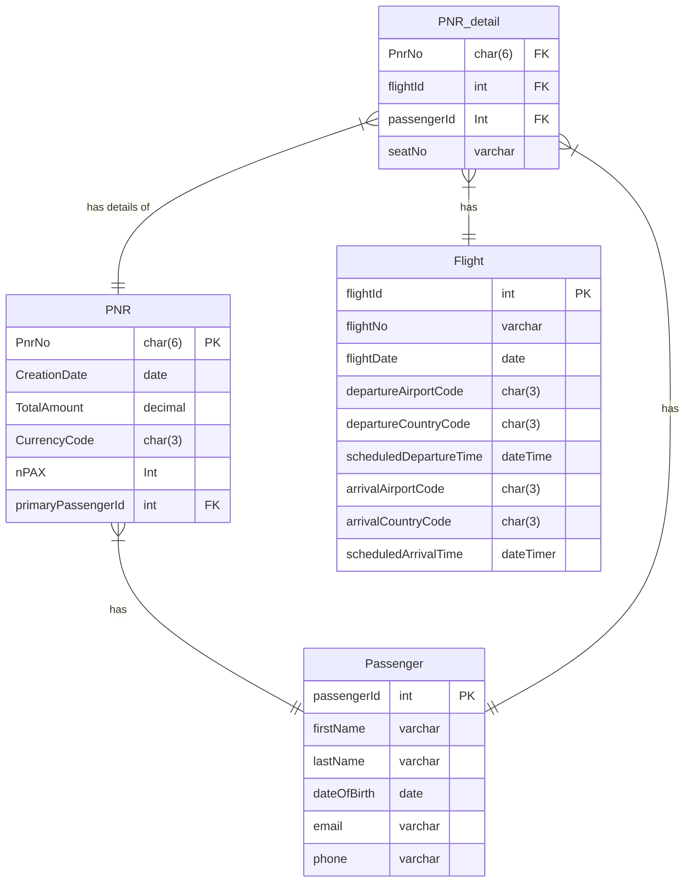

# Data Engineering Track

## Overview

This track will guide you through the essential skills and knowledge needed to become a proficient Data Engineer. You'll learn to build scalable data systems, work with large datasets, and enable data-driven decision-making within organizations.

## Goals

By completing this track, you will:
- Understand core data engineering principles and best practices
- Gain hands-on experience with industry-standard tools and platforms
- Develop the skills to design, build, and maintain data systems
- Be prepared to contribute to data engineering teams and projects

## Learning Path

### [Part 1: Fundamentals](part-1-Fundamentals.md)
- [Azure Databricks](part-1-Fundamentals.md#azure-databricks)
- [Azure Data Factory (Optional)](part-1-Fundamentals.md#optional-azure-data-factory-optional)
- [Mermaid Code for Modelling Data and Visualizing](part-1-Fundamentals.md#mermaid-code-for-modelling-data-and-visualizing)
- [Get familiar with Data - OpenSky](part-1-Fundamentals.md#get-familiar-with-data---opensky)
- [Exercise](part-1-Fundamentals.md#exercise)


### [Part 2: Data Ingestion](part-2-Data-Ingestion.md)
- [Ingest Flights data](part-2-Data-Ingestion.md#ingest-flights-data)
- [Ingest Metadata](part-2-Data-Ingestion.md#ingest-metadata)
- [Ingest State Vectors data](part-2-Data-Ingestion.md#ingest-state-vectors-data)
- [Deliverables](part-2-Data-Ingestion.md#deliverables)


### [Part 3: Data Transformation](part-3-Data-Transformations.md)
- [Bronze Layer](part-3-Data-Transformations.md#bronze-layer)
- [Silver Layer](part-3-Data-Transformations.md#silver-layer)
- [Gold Layer](part-3-Data-Transformations.md#gold-layer)
- [Deliverables](part-3-Data-Transformations.md#deliverables)

### [Part 4: Data Serving](part-4-Data-Serving.md)
- [Dashboard of data analysis for OpenSky data](part-4-Data-Serving.md#dashboard-of-data-analysis-for-opensky-data)

<br>
<br>
<br>

# Advanced Data Engineering

This section contains **optional** advanced exercises for those who complete the **Data Engineering Track** and wish to continue with more challenging material on the advanced track.

## Goals
1. Create a first version of Enterprise Data Warehouse (EDW) in Lakehouse, for Lufthansa group airlines by integrating booking data, flight booking status and flight operations status. The EDW should be designed to make it easy to integrate new data sources in future.

1. Create data marts to generate reports and visualisation on:
    - Percentage of flights marketed by Hub airlines, which are fully or partly operated by carriers other than marketing carrier.

    - View of number of flights delayed at various levels like airport, country and continent.

    - Count of flights to various destinations, to get a picture of 'most flown' locations and areas with no service.

    - Realtime visualisations on flight booking status, to see the load factor (percentage of seats booked) per cabin class(economy, business etc) for flights departing in next 2 days. The business case will be to identify 'under booked' flights and take decisions to reduce the loss. 

1. Visualisation using the BI tool provided.

## Scope
1. Data model for silver and gold layer to support all the requirements and to support integration of new systems in future.
1. Implementation of integrating flight operation status data from LH Open API.

## Out of Scope
1. Generating reports in Power BI.
1. Creating infrastructure. Infrastructure will be provided.
1. Implementation of integrating booking data and flight booking status data.

## Tools and services available for implementation
**Storage:** Azure Data Lake Storage Gen2.\
**Data processing:** Databricks(Spark)\
**Languages:** python (pyspark)\
**Orchestration and scheduling:** Databricks Workflows, Delta Live Tables

## Data sources

**Flight operation status**

Flight operation status data can be integrated from LH Open API's [flight status departure](https://developer.lufthansa.com/docs/read/api_details/operations/Departures_Status) and [flight status arrival](https://developer.lufthansa.com/docs/read/api_details/operations/Flight_Status_by_Airport) end points. The scope is all flights departing and arriving at FRA and MUC airports.

💡 Tip When there are no flights in the time range requested, the API returns error. So please beware of the windows where there are no flights (for example during night-flight ban at FRA).

**Booking data**

⚠️ ATTENTION This is an imaginary data source, which is included to make the architecture and data modelling exercises more challenging. Implementation of data pipelines to integrate this data source is out of scope of this EPIC.

Booking data is available from an OLTP database (SQL server). The booking data is available in the tables below.



**Flight booking status**

⚠️ ATTENTION This is an imaginary data source, which is included to make the architecture and data modelling exercises more challenging. Implementation of data pipelines to integrate this data source is out of scope of this EPIC.

This is a Kafka topic which will give information about the booking status of all LH flights departing in next 48 hours, and gives an update whenever the booking status for each flight changes. The message has below json structure

```json
flight_number                           -- String
date                                    -- String
booking status                          -- Array
    cabin_type                          -- String
    capacity                            -- Integer
    booked                              -- Integer
last_updated                            -- String
```


## Learning Path
### [Part 5: Architecture and Data Modelling](part-5-Architecture-and-Data-Modeling.md)
- [Architecture](part-5-Architecture-and-Data-Modeling#architecture)
- [Data Ingestion](part-5-Architecture-and-Data-Modeling#data-ingestion)
- [Datamodel for Bronze Layer](part-5-Architecture-and-Data-Modeling#datamodel-for-bronze-layer)
- [Datamodel for Silver Layer](part-5-Architecture-and-Data-Modeling#datamodel-for-silver-layer)
- [Datamodel for Gold Layer](part-5-Architecture-and-Data-Modeling#datamodel-for-gold-layer)

### [Part 6: ELT Pipelines](part-6-ELT-Pipelines.md)
- [Create tables in all layers](part-6-ELT-Pipelines#create-tables-in-all-layers)
- [Code organising and Python environment](#code-organising-and-python-environment)
- [Ingest to Bronze Layer](part-6-ELT-Pipelines#ingest-to-bronze-layer)
- [Ingest to Silver Layer](part-6-ELT-Pipelines#ingest-to-silver-layer)
- [Ingest to Gold Layer](part-6-ELT-Pipelines#ingest-to-gold-layer)

### [Part 7: BI on Lakehouse](part-7-BI-on-Lakehouse.md)
- [Pre-requisites for creating dashboards](part-7-BI-on-Lakehouse#pre-requisites-for-creating-dashboards)
- [Create Dashboard](part-7-BI-on-Lakehouse#create-dashboard)

### [Part 8: Performance and Cost Optimization](part-8-Performance-and-Cost-Optimization)

### [Part 9: Data Governance](part-9-Data-Governance)
- [Access control for tables and views](part-9-Data-Governance#access-control-for-tables-and-views)
- [Data Lineage](part-9-Data-Governance#data-lineage)

### [Part 10: Taking to Production](part-10-Taking-to-Production)
- [CICD for data pipeline components](part-10-Taking-to-Production#cicd-for-data-pipeline-components)
- [Code refactoring for deployment](part-10-Taking-to-Production#code-refactoring-for-deployment)
- [Lakehouse Change management](part-10-Taking-to-Production#lakehouse-change-management)