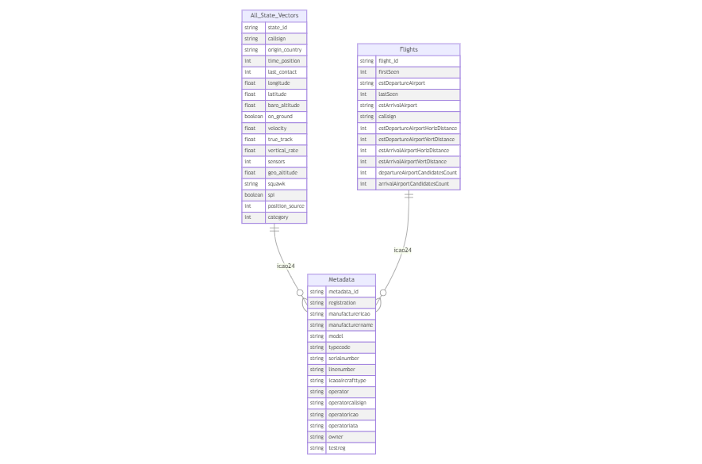

# Part 3: Data Transformation

Data transformation is the process of converting data from one format or structure to another, while preserving its original meaning. It involves manipulating and reshaping data to make it more suitable for analysis or for use in a particular system or application.

Data transformation is important for several reasons. Firstly, it can help to clean and standardize data, which is often collected from various sources in different formats. By transforming data into a consistent format, it becomes easier to compare and analyze. Secondly, data transformation can help to create new variables or features from existing data, which can be used to improve the accuracy of predictive models. Finally, data transformation can help to improve data privacy and security, by removing sensitive information or encrypting data during the transformation process.

We will use the Medallion architecture to transform the data in Databricks Lakehouse, where data are organised in three different layers:

- Bronze layer - raw data as they come from the source
- Silver layer - cleaned and consolidated data
- Gold Layer - enriched and aggregated data for analysis

Medallion architecture reference:
- https://learn.microsoft.com/en-us/azure/databricks/lakehouse/medallion
- https://www.databricks.com/glossary/medallion-architecture

Resource for SDP:

- https://learn.microsoft.com/en-us/azure/databricks/ldp/transform

## Outline
- [Bronze Layer](#bronze-layer)
- [Silver Layer](#silver-layer)
- [Gold Layer](#gold-layer)
- [Deliverables](#deliverables)

## Bronze Layer

The first layer on the Medallion architecture is Bronze layer, where we land all the data from external source systems. The table structures in this layer correspond to the source system table structures "as-is," along with any additional metadata columns that capture the load date/time, process ID, etc.

Lakeflow Spark Declarative Pipelines (SDP) makes it easy to build and manage reliable batch and streaming data pipelines that deliver high-quality data on the Databricks Lakehouse Platform. SDP helps data engineering teams simplify [ETL](https://www.databricks.com/discover/etl) development and management with declarative pipeline development, automatic data testing, and deep visibility for monitoring and recovery.

## Silver Layer
Upon ingestion into the silver layer, data is filtered, cleaned and augmented. This could mean the data is deduplicated, missing data is handled, incorrect data is removed or corrupted data is fixed.

## Gold Layer
Going into the gold layer the data is transformed for specific use cases and Business level aggregation is applied. At this level business rules are applied and data from different source files or systems may also be joined together.

In our case, we will create two gold tables from joining the silver data sets, as per below data model:

## Deliverables:
Create a Databricks notebook that implements the Medallion architecture:
- Ingest raw data into Bronze layer using Auto Loader
- Transform and clean data into Silver layer
- Create aggregated Gold layer tables based on the provided schema
- Document your transformation logic and data quality checks