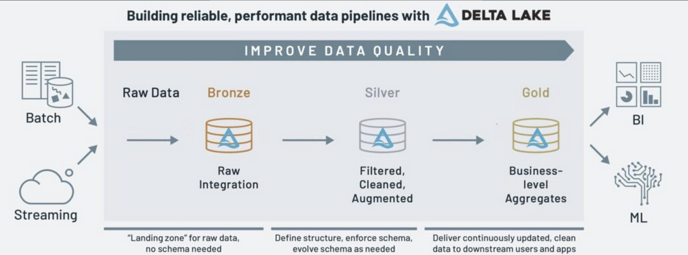

# Part 3: Data Transformation (Medallion Architecture)

Data transformation is the process of converting data from one format or structure to another, while preserving its original meaning. It involves manipulating and reshaping data to make it more suitable for analysis or for use in a particular system or application.

Data transformation is important for several reasons:
1. It can help to clean and standardize data, which is often collected from various sources in different formats. By transforming data into a consistent format, it becomes easier to compare and analyze.
1. It can help to create new variables or features from existing data, which can be used to improve the accuracy of predictive models.
1. It can help to improve data privacy and security, by removing sensitive information or encrypting data during the transformation process.

## Goal  
Transform raw Lufthansa data into structured, analytics-ready Delta tables using the Bronze → Silver → Gold architecture.

## Scope  
- Bronze:
  - Load raw data using Auto Loader
  - Preserve source structure + metadata  
- Silver:
  - Clean, standardize, deduplicate  
  - Handle missing/invalid data
  ...
- Gold:
  - Apply business logic  
  - Create aggregated analytics Gold layer tables  
- Document transformation logic and quality checks  

## Hint & Sources  
- Medallion Architecture:  
  - https://learn.microsoft.com/en-us/azure/databricks/lakehouse/medallion
  - https://www.databricks.com/glossary/medallion-architecture
- Resource for Lakeflow Spark Declarative Pipelines (SDP):  
  https://learn.microsoft.com/en-us/azure/databricks/ldp/transform  

## Outcome  
- Bronze, Silver, Gold Delta tables  
- Documented data quality rules  
- Sample analytical queries on Gold layer  

## Bonus

- Implement SCD Type 1 or Type 2 to handle changes in reference data (e.g., Airports, Airlines). [Source](https://medium.com/@naveen140882/understanding-scd-type-1-vs-scd-type-2-with-an-example-e188373d5304)
- Add data quality expectations and constraints to your pipeline (e.g., null checks, range validations, referential integrity)   [Source](https://docs.databricks.com/en/delta-live-tables/expectations.html) 
- Implement lineage tracking to trace data flow from source to gold layer (e.g. custom metadata columns) - [Source](https://learn.microsoft.com/en-us/azure/databricks/data-governance/unity-catalog/data-lineage)
- Add schema evolution handling to manage changes in source data structure.
- Create quality metrics dashboard or reports showing validation results.
- Implement error handling and quarantine tables for records that fail validation

## Did you know that…?

### SDP
Lakeflow Spark Declarative Pipelines (SDP) makes it easy to build and manage reliable batch and streaming data pipelines that deliver high-quality data on the Databricks Lakehouse Platform. SDP helps simplify Extract Transform Load ([ETL](https://www.databricks.com/discover/etl)) development and management with declarative pipeline development, automatic data testing, and deep visibility for monitoring and recovery.
